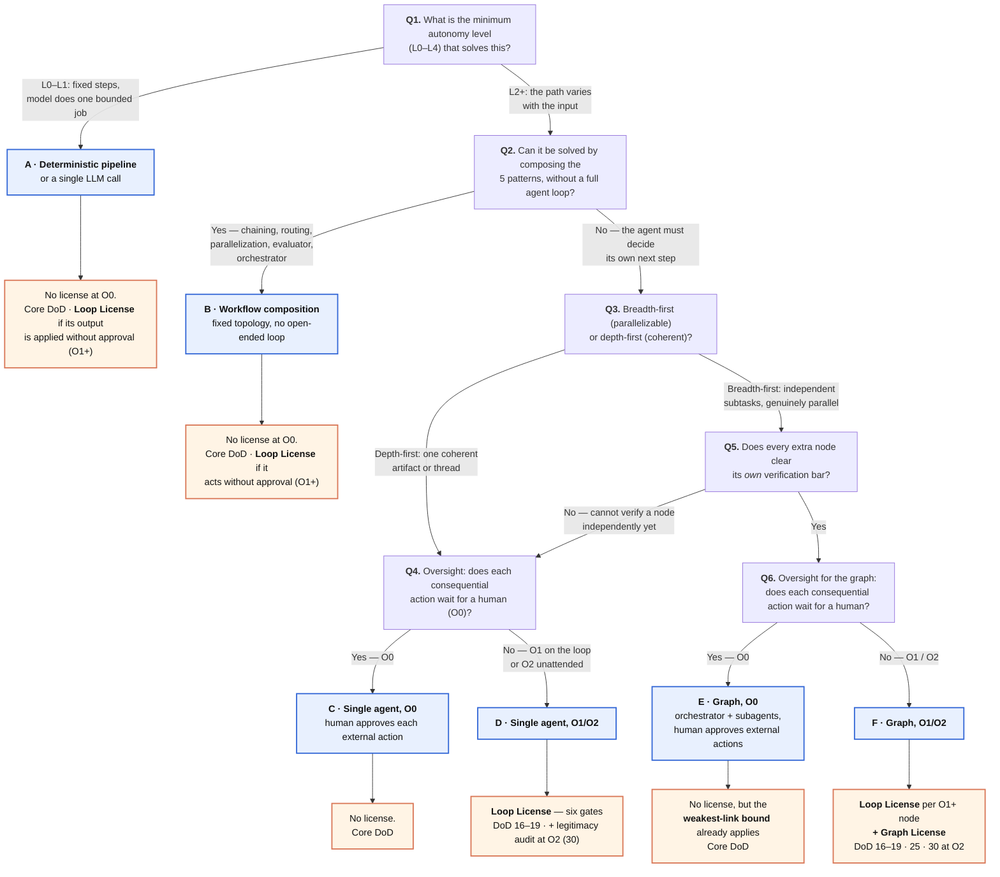

# Which agent architecture should you actually build?

*From [The Agentic Product Standard](../../STANDARD.md). One page, from "we want an agent" to a named architecture **and the license it owes**.*

The viral version of this question stops at the architecture. That is the easy half: picking a shape is a whiteboard decision, and every shape works in a demo. The half that decides whether the thing survives production is **what the shape owes** — which failure modes it invites, what permission tier it needs, what its eval plan has to cover, and which license it must hold before it acts without a human approving each step. This tree carries both columns to every leaf.

Since v4.0 the tree asks two separate questions, because the standard places every system on two axes (Canon 1): **autonomy** — who chooses the next step (L0–L4) — decides the *architecture*; **oversight** — whether a human approves each consequential action (O0 in the loop, O1 on the loop, O2 unattended) — decides the *license*. An L3 orchestrator whose every action waits for approval owes no Loop License; an L2 pipeline that auto-applies its output does.

It is **derived from** the [10-question checklist](../../README.md#-the-10-question-checklist), which stays the single source of truth. A CI check fails if the canon changes and this page does not.

---

## The tree



**Core DoD** = every Definition of Done item that binds without an oversight or composition condition — the ones with no condition in `STANDARD.md` Part III, plus the conditional items your product triggers (MCP → 14, 26; LLM judges → 11, 20; retrieval → 21; multi-tenant → 32; a regulated market → 31). Delegating across an organization or vendor boundary adds 28 at any leaf.

---

## The leaves — architecture **and** what it owes

| Leaf | Architecture | Oversight | License required | Checklist | DoD |
|---|---|---|---|---|---|
| **A** | Deterministic pipeline, or a single LLM call inside fixed steps | O0 (O1+ if its output is applied without approval) | None at O0; **Loop License** at O1+ | [`loop-license/CHECKLIST.md`](../loop-license/CHECKLIST.md) at O1+ | Core (+ 16–19 at O1+) |
| **B** | Workflow composition — the [five patterns](../../STANDARD.md#canon-2-the-five-composition-patterns) with a fixed topology and no open-ended loop | O0 (O1+ if it acts without approval) | None at O0; **Loop License** at O1+ | [`loop-license/CHECKLIST.md`](../loop-license/CHECKLIST.md) at O1+ | Core (+ 16–19 at O1+) |
| **C** | Single agent — it decides its next step; a human approves every consequential action | O0 | None | — | Core (+ 17 at L3+) |
| **D** | Single agent whose consequential actions run without per-action approval | O1 / O2 | **Loop License** (+ legitimacy audit at O2) | [`loop-license/CHECKLIST.md`](../loop-license/CHECKLIST.md) | Core + 16–19 (+ 30 at O2) |
| **E** | Graph of agents — orchestrator plus subagents, human approves external actions | O0 | None — but the **weakest-link bound** already governs any path you later promote | [`graph-license/CHECKLIST.md`](../graph-license/CHECKLIST.md) (as a design aid) | Core |
| **F** | Graph of agents whose consequential actions run without per-action approval | O1 / O2 | **Loop License per O1+ node** *and* a **Graph License** for the composition | [`graph-license/CHECKLIST.md`](../graph-license/CHECKLIST.md) | Core + 16–19 · 25 (+ 30 at O2) |

**Leaf F is the one people get wrong.** A graph of licensed loops is *not* a licensed graph — the risks that hurt are the ones no single node owns (Part IV, *License Composition*; anti-pattern 19). **Leaves A and B at O1+ are the ones people forget:** a "simple pipeline" that writes its output to production without review has relaxed oversight just as surely as an autonomous loop has.

---

## The governance column, per leaf

The four questions the architecture genre skips. Answer them at the same whiteboard, not after the incident.

| Leaf | Failure modes to name first | Permission tier | Eval plan must cover | License |
|---|---|---|---|---|
| **A** | Bad parse, schema drift, silent fallback | Read-mostly; writes behind code | Unit + schema; a handful of end-to-end cases | — (Loop License at O1+) |
| **B** | Wrong branch taken; a stage passing junk downstream | Per-stage least privilege | Per-stage cases **and** the composed path | — (Loop License at O1+) |
| **C** | Wrong tool, wrong target, context exhaustion | Every external action approved by a human | ≥50 cases per named failure mode; judges calibrated | — |
| **D** | Runaway loop, unbounded spend, hijack via "find work", success by gaming the checks | Blast radius declared and enforced below the model | The above **plus** injection cases on the find-work path; `pass^5`; a legitimacy audit at O2 | **Loop License** |
| **E** | Handoff loses context; a node acting on another's unverified output | Per-node least privilege; external actions human-approved | Per-node **plus** end-to-end graph tasks | — |
| **F** | Everything in D and E, plus: fan-out multiplying spend past per-node caps; unverified aggregation at fan-in; an uncalibrated node lending a path oversight it never earned; a kill switch that never met an in-flight branch | Blast radius = union of node radii **plus** the shared state store | Graph-level golden tasks; **poisoned-state** scenarios; per-edge judge decorrelation | **Loop + Graph License** |

---

## The loop-vs-graph branch, in our terms

Q5 is the branch the market argues about. Reasons to add a node, stated as things you must be able to *show*, not prefer:

- **Specialty handoff** — a subtask needs a materially different skill, and you can name the boundary.
- **Genuine fan-out** — subtasks are independent, and parallelism buys wall-clock you actually need.
- **Per-step model or toolset** — a step wants a different model tier or a tool surface the others must not hold.
- **Auditable routing** — you need to see *which* path a request took, as a first-class record.
- **Failure isolation** — one subtask failing must not take the others with it.
- **A dedicated reviewer** — verification wants its own contract, decorrelated from the producer.

> **The exit criterion: every extra node must clear its own verification bar.** If you cannot say how a node is independently verified — deterministically where possible, by a calibrated and decorrelated judge otherwise — it is not a node yet. Adding it converts an evaluable system into an unevaluable one, which is anti-pattern 1 (multi-agent before a single-agent baseline) wearing a topology.

---

## Derivation from the canon

This tree asks a subset of the [10-question checklist](../../README.md#-the-10-question-checklist) as branch conditions; the rest are carried in the governance column above, because they shape *how* you build the leaf rather than *which* leaf you land on. The canon is the single source of truth — this page is a surface over it, and CI fails if they drift apart.

| Canon question | Where it lives here |
|---|---|
| `What is the minimum autonomy level (L0–L4) that solves this, and under which oversight mode (O0–O2)?` | **Q1** — the root branch (autonomy decides the architecture); **Q4** and **Q6** (oversight decides the license) |
| `Can it be solved by composing the 5 patterns without a full agent loop?` | **Q2** |
| `Is the task breadth-first (parallelizable) or depth-first (coherent)?` | **Q3** |
| `What are the 3 failure modes that would lose user trust first?` | Governance column — *Failure modes to name first* |
| `Where are the permission boundaries? What MUST the agent NOT do?` | Governance column — *Permission tier*; the blast radius at leaves D and F |
| `Which constraint dominates framework choice?` | Deliberately **not** a branch — this tree binds topology, not runtime (Stack 7 decides the framework) |
| `Where does state live? (in-context = anti-pattern for long-running)` | Governance column; the shared state store is part of the blast radius at leaf F |
| `Who validates outputs at each stage? (assertion / LLM judge / human review)` | **Q5** — the verification bar every extra node must clear |
| `Where do traces live, with what retention?` | Governance column — *Eval plan*; DoD 12 and 29 at every leaf |
| `Eval set: how many examples, who labels, how does it grow?` | Governance column — *Eval plan*; DoD 10, 22 |

---

## Regenerating the social export

The Mermaid block above is the primary artifact — diffable, and it renders natively on GitHub. For a raster/vector export to attach to a release:

```bash
npx -y @mermaid-js/mermaid-cli -i templates/decision-tree/README.md -o decision-tree.svg
```

*The export is a derivative. When the tree changes, regenerate it — never edit the SVG.*
